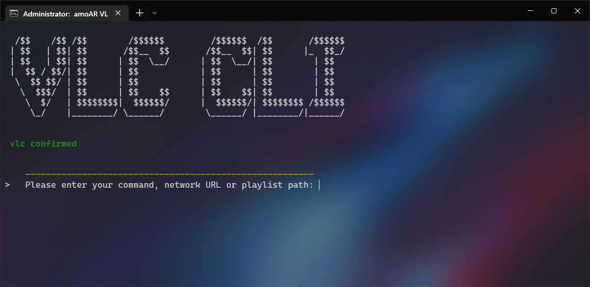
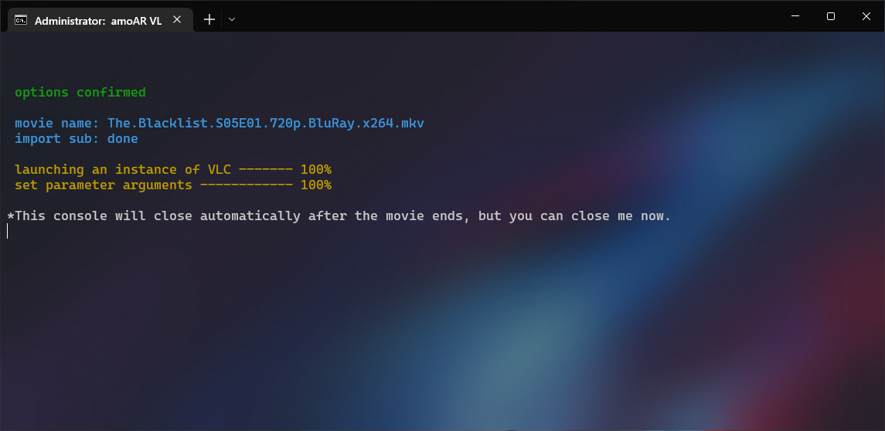

<a name="readme-top"></a>

<a style="text-decoration:none" href="https://github.com/amoAR/VLC-CLI-network-stream-url/releases">
    
</a>

# VLC CLI network stream URLs

This script has been produced for ease and a little beauty in streaming HTTP, HTTPS resources as a single or playlist with global VLC options and automatic subtitles of series.

<!-- PROJECT LOGO -->
<br />
<div align="center">
  

  <h3 align="center">VLC CLI for network HTTP urls</h3>

  <p align="center">
  Command line interface for stream online HTTP urls in VLC with option commands &amp; auto detect subtitle
    <br />
    <br />
    <a href="https://github.com/amoAR/VLC-CLI-network-stream-url/wiki"><strong>Explore the wiki »</strong></a>
    <br />
    <br />
    <a href="https://github.com/amoAR/VLC-CLI-network-stream-url/issues">Report issue</a>
    ·
    <a href="https://github.com/amoAR/VLC-CLI-network-stream-url/pulls">Pull request</a>
  </p>
</div>

<!-- TABLE OF CONTENTS -->
<details>
  <summary>Table of Contents</summary>
  <ol>
    <li>
      <a href="#getting-started">Getting Started</a>
      <ul>
        <li><a href="#prerequisites">Prerequisites</a></li>
        <li><a href="#installation">Installation</a></li>
      </ul>
    </li>
    <li><a href="#usage">Usage</a></li>
    <li><a href="#license">License</a></li>
    <li><a href="#contact">Contact</a></li>
    <li><a href="#screenshots">Screenshots</a></li>
  </ol>
</details>

<!-- GETTING STARTED -->

## Getting Started

To start, download the latest released version, then unzip it.
Installation is complete!

### Prerequisites

You don't need a lot!

- Windows OS

- VLC (Preferably the latest version)<br />
  You can get the latest version from their [official website](https://www.videolan.org/vlc)
  <br />

### Installation

This is just a script and does not need to be installed. Just note that you can create a shortcut for it and you don't want to get confused between the program files.

<h4 align="left">How create shortcut?</h4>

1. Move your extracted download folder to the location you want it to be. `(optional)`

   - For example, you can move it from the `Downloads folder` (the default location for files downloaded by the browser) to the `Program Files folder` on the C drive or even on your `desktop`, it doesn't matter. <br /><br /> In this tutorial we put it in C drive :<br /><br />

   ```
   C:\Program Files\CLI
   ```

   - You can also change the name of the folder from CLI to anything else.
     <br />

2. Enter the folder and look for the VLC file with the extension .bat

   ```
   C:\Program Files\CLI\VLC.bat
   ```

   <br />

3. Right-click the `VLC.bat`, and then click `Send To > Desktop (Create shortcut)`. A shortcut for the program appears on your desktop
   <br />

   > If your can't find `Send To` option, select the `Create Shortcut` option on Right-click menu, then manually move the shortcut file to your desktop.

   - If it does not appear, refresh your desktop once.
     <br />

4. Now you can make any changes on this shortcut, such as icon, name, console settings, etc
<br />

5. Click on the shortcut to open it. Installation is complete!

<p align="right">(<a href="#readme-top">back to top</a>)</p>
<br />

<!-- USAGE EXAMPLES -->

## Usage

1. The first time you run the program, if your VLC installation location is not recognized by the program, it will ask you to enter it manually. So you will see this message :<br /><br />
   ```
   Unfortunately, we could not find VLC location. please enter it manually.
   ```
    - You must enter path of the parent folder of the VLC program file.

      _For example:_ (C:\Program Files\VideoLAN\VLC)
  <br />

2. The next question is related to one of the features of the script (subtitle automatic detection). It will asks you to specify its location if you have a subtitle folder ` (optional) `

    _For example:_ (C:\Users\YourName\Desktop\mySubFolder)
  <br /><br />

3. You are ready to begin. Enter `-help` for help.<br />
Also, the wiki is [here](https://github.com/amoAR/VLC-CLI-network-stream-url/wiki) for the description of the features.

<p align="right">(<a href="#readme-top">back to top</a>)</p>
<br />

<!-- LICENSE -->

## License

Distributed under the MIT License. See [LICENSE.md](LICENSE.md) for more information.

<p align="right">(<a href="#readme-top">back to top</a>)</p>
<br />

<!-- Screenshots -->

## Screenshots

> In the pictures below, program is run in the [Windows Terminal](https://apps.microsoft.com/store/detailwindows-terminal9N0DX20HK701?hl=en-us&gl=US) environment.
>
> <h4>main screenshot : :arrow_down_small:</h4>
>
> 
>
> <h4>result screenshot : :arrow_down_small:</h4>
>
> 
<br />

<!-- CONTACT -->

## Contact

amoAR - arvinhad2026@gmail.com

Project Link: [https://github.com/amoAR/VLC-CLI-network-stream-url](https://github.com/amoAR/VLC-CLI-network-stream-url)

Download Link: [https://github.com/amoAR/VLC-CLI-network-stream-url/releases](https://github.com/amoAR/VLC-CLI-network-stream-url/releases)

<p align="right">(<a href="#readme-top">back to top</a>)</p>